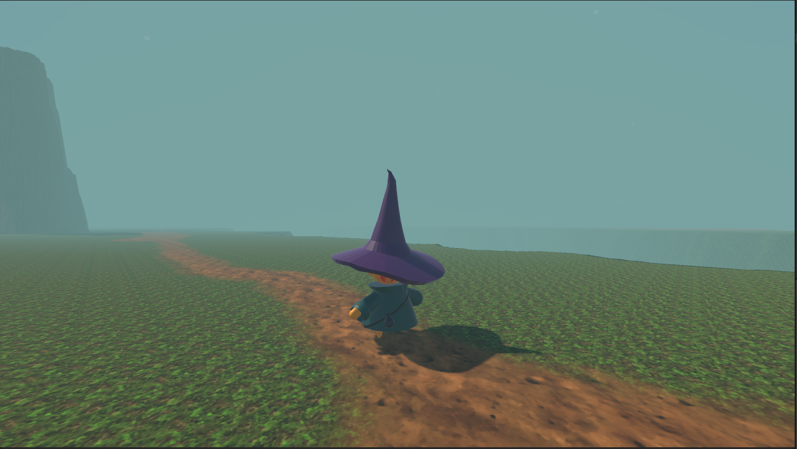
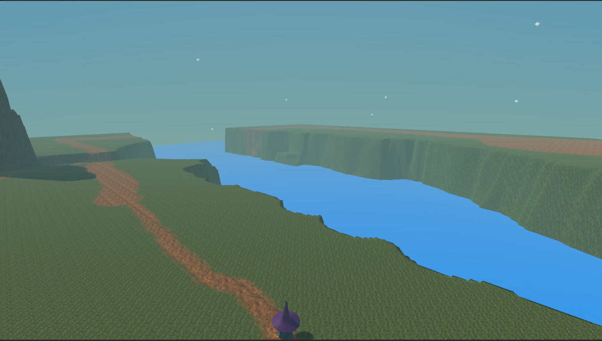

# **Takım İsmi**

Takım Unity 36/ WEZARD

# Ürün İle İlgili Bilgiler

## Takım Elemanları
- Beyza Nur Bayrakdaroğlu: Scrum Master / Product Owner
- Jamshid Abdukarimov: Developer
- Tamer Molla: Developer
- Hasan Hüseyin Özkul: 3D Artist / Developer
- Havva Çetinkaya: 3D Artist

## Ürün İsmi

WEZZY

## Ürün Açıklaması

Wezzy adlı büyücümüz ormanda yaşayan ve artık büyücülük hayatındaki en üst kademe olan baş büyücülüğü için orman içerisinde bir yolculuğa çıkar. Bu yolculuklta büyücümüz bulmacalı kapılarla karşılaşacak, diğer baş büyücü olmak isteyen büyücülerle karşılacak ve daha bir çok macera onu bekleyecek. Bu eğlenceli ve maceralı yolun sonunda büyücümüz kitaba ulaşabilirse baş büyücü olmayı başaracaktır.

## Ürün Özellikleri
- Macera oyunu
- Bulmaca çözme
- Büyülü tema 
- Anlaşılabilir hikaye
    
## Hedef Kitle
Her yaşta macera oyunlarına ve oyunlarda bulmacalar çözmeye ilgi duyanlar, büyü ve büyücü konseptleri hoşuna giden oyun sever herkese hitap eden bir oyundur.

## Juriye Not

## Product Backlog URL
https://miro.com/app/board/uXjVMAhbbRE=/

---
## Sprint Board Update

## Sprint Notları:
Product backlogların içerisinde user storyler okunabilmektedir.

## Sprint içinde tamamlanması tahmin edilen puan:  100 Puan 

## Puan Tamamlama Mantığı: 
Toplamda proje boyunca 300 puanlık backlog bulunmaktadır. İlk sprint için tamamlanmasını beklediğimiz backlog 100 puanlıktır.

## Backlog düzeni ve Story seçimleri:
Backlogda ilk olarak önemli olan işlerimizi yapmaya başladık ve ilerledikçe eklemek istediklerimizi yazdık. Bu şekilde ilk seçilenlerle tahmin edilen bir puan oluşturduk ve süreçte bu şekilde ilerledik.

## Daily Scrum:
Daily Scrum toplantılarımız genel olarak Discord ve Whatsapp üzerinden zamansal sebeplerden dolayı hem sesli hem mesaj olarak süreç boyunca ilerlemiştir.
 https://docs.google.com/document/d/15d6q0cZefiA-DUNQPOYKELL8HnMiQj-_/edit?usp=sharing&ouid=102302724524538820380&rtpof=true&sd=true
## Ürün Durumu: 
Ekran görüntüleri:
    

## Sprint Review: 
Oyun konusu, hikayesi, ara sahneler, karakterler belirlendi.büyücü modeli yapıldı, büyü kitabı modeli ve animasyonu bitti. Oyun içerisinde level design oluşturulmaya başlandı, karakterin hareketleri sağlandı. Katılımcılar: Tüm ekip

## Sprint Retrospective:
2.spinte daha çok gayret ve çaba gösterlmesi kararı alındı, modelleme ve yazılım kısımlarında hızlanılması gerekildiği, günlük toplantılar için olabildiğince katılım sağlama, iş bölümlemelerinin daha dengeli olması, finaller yüzünden herkes çok odaklanamadığı için 2.sprit içerisinde bu açığımızı kapatmak üzerine kararlar alındı
---
##SPRİNT 2
---
## Sprint Board Update

## Sprint Notları:
Product backlogların içerisinde user storyler okunabilmektedir. Ek olarak kullanılacak linkler de içlerine yazıldı.

## Sprint içinde tamamlanması tahmin edilen puan: 110 Puan 

## Puan Tamamlama Mantığı: 
Toplamda proje boyunca 300 puanlık backlog bulunmaktadır. İlk sprint için tamamlanmasını beklediğimiz backlog 100 puanlıkı ama 90 puan yaptığımız ve açığımızı kapatmak için ikinci sprint içerisinde 100 puan olması gereken puanı 110 yapmaya karar verildi.
## Backlog düzeni ve Story seçimleri:
Backloglar ilk sprintteki ilerlediğimiz plan üzeirnden sürece devam edildi. Yaptığımız toplantılarda da ekstra çıkacak olan işler üzerine düzenlenerek ilerlendi.

## Daily Scrum:
Daily Scrum toplantılarımız genel olarak Discord ve Whatsapp üzerinden zamansal sebeplerden dolayı hem sesli hem mesaj olarak süreç boyunca ilerlemiştir.
 https://docs.google.com/document/d/15d6q0cZefiA-DUNQPOYKELL8HnMiQj-_/edit?usp=sharing&ouid=102302724524538820380&rtpof=true&sd=true
## Ürün Durumu:

## Sprint Review: 
Oyun içerisinde bulunacak bulmaca oluşturuldu, mağara modeli yapıldı, karakterin animasyonları eklendi, asa entegrasyonu ayarlandı, kütük modeli yapıldı, karakter skill özellikleri eklendi. Katılımcılar: Tüm ekip

## Sprint Retrospective:
3.Sprintte ikinici sprinte göre işleri daha fazla bölümleyeceğimize, ilk hafta bitiminde artık oyunumuzun sonuna gelinmesi gerektiğine karar verdik. Kısıtlı zaman içerisinde etkili iletişim kurmak için 3.sprint boyunca çoğunlukla sesli toplantılarda görüşüleceğine karar verildi. 3.sprintte daha temiz ve zaman odaklı gidilmesine karar verildi.

## SPRİNT 3
---
## Sprint Board Update

## Sprint Notları:
Product backlogların içerisinde user storyler okunabilmektedir. Ek olarak kullanılacak linkler de içlerine yazıldı.
## Sprint içinde tamamlanması tahmin edilen puan:  100 Puan 

## Puan Tamamlama Mantığı: 
Toplamda proje boyunca 300 puanlık backlog bulunmaktadır. İlk sprint için tamamlanmasını beklediğimiz backlog 100 puanlıktır.

## Backlog düzeni ve Story seçimleri:
Backlogda ilk olarak oyunda önemli bitirilecek kısımlara ve trailera odaklandık. Bu şekilde ilk seçilenlerle tahmin edilen bir puan oluşturduk ve süreçte bu şekilde ilerledik.
## Daily Scrum:
Daily Scrum toplantılarımız genel olarak Discord ve Whatsapp üzerinden zamansal sebeplerden dolayı hem sesli hem mesaj olarak süreç boyunca ilerlemiştir.
 https://docs.google.com/document/d/15d6q0cZefiA-DUNQPOYKELL8HnMiQj-_/edit?usp=sharing&ouid=102302724524538820380&rtpof=true&sd=true
## Ürün Durumu: 
Ekran görüntüleri:

